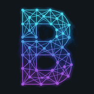
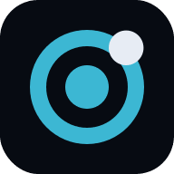
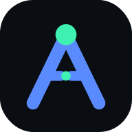
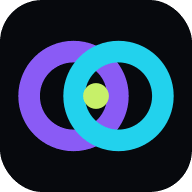
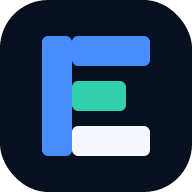
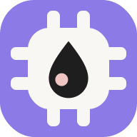

# Blockchains

Sites, ventures and research by **Ismail Malik** — blockchain, AI agents, regulation and the programmable economy.

## Live sites

| | Site | What it is | Link |
|---|---|---|---|
|  | **[Blockchain Lab](https://blockchainlab.com/)** | Blockchain Lab explains how blockchain systems work, what changed in practice, and how founders and institutions build programmable infrastructure. A venture studio and a research library. Not a trading venue. | [blockchainlab.com](https://blockchainlab.com/) |
|  | **[The Grok Hack](https://grokhack.com/)** | The world's first global hackathon powered by Grok. 30 days in November. Turbocharge a partner platform. Exclusive prize · TBA. | [grokhack.com](https://grokhack.com/) |
|  | **[GrokSkill](https://grokskill.com/)** | Fifty Grok skills you can run in the browser or install. Each one is a method, a deliverable, and a SKILL.md file. No sign-in. | [grokskill.com](https://grokskill.com/) |
|  | **[AgentiCoins](https://agenticoins.com/)** | AgentiCoins is the trusted commerce layer for AI agents. Discover verified services, set policy, route payment intents and keep a receipt for every action. | [agenticoins.com](https://agenticoins.com/) |
|  | **[AltVaults](https://altvaults.com/)** | AltVaults enables institutions to launch, operate, distribute and route digitally operable investment vaults across private markets, tokenised assets and DeFi. | [altvaults.com](https://altvaults.com/) |
|  | **[EPIC](https://equityperpetual.com/)** | The independent intelligence layer for equity perpetual markets. Compare funding, basis, contract terms, venue risk and market-closure conditions. | [equityperpetual.com](https://equityperpetual.com/) |
|  | **[Regulation Crypto Assets](https://regulationcryptoasset.com/)** | Independent intelligence for regulated digital assets — curated primary-source content, issuer research and regulatory context. | [regulationcryptoasset.com](https://regulationcryptoasset.com/) |
|  | **[RCA Pad](https://rcapad.com/)** | Clear crypto regulation briefings and RCA context — track digital-asset rules, compliance signals, and what changed. | [rcapad.com](https://rcapad.com/) |
|  | **[Land.solar](https://land.solar/)** | AI-native OS for finding, proving, financing and transacting UK land for solar, battery storage and grid-connected energy. | [land.solar](https://land.solar/) |
|  | **[Induscript](https://induscript.com/)** | An open, evidence-led research platform for the Indus script and the possible language(s) behind it. Explore inscriptions, methods, and hypotheses. | [induscript.com](https://induscript.com/) |
|  | **[11Plus.College](https://11plus.college/)** | An immersive English-learning adventure that helps children build vocabulary, crack comprehension, write brilliantly and prepare for the 11+ with confidence. | [11plus.college](https://11plus.college/) |
|  | **[HACKERS](https://hackers.college/)** | HACKERS is a selective college for ethical problem-solvers. Study seventeen Hack Atlas studios, train SCAN / FLIP / BUILD / BREAK / PROVE, and wear HACKERS Supply. File 001: permission chains. File 018: trust-graph calculus. | [hackers.college](https://hackers.college/) |
|  | **[GPU.Skin](https://gpu.skin/)** | GPU.Skin personalizes skincare with high-compute analysis — clearer routines, better matches, skin upgraded for you. | [gpu.skin](https://gpu.skin/) |
|  | **[HalalSwitch](https://halalswitch.com/)** | Switch to halal home finance with confidence. Compare verified Sharia-compliant home-finance providers on HalalSwitch. | [halalswitch.com](https://halalswitch.com/) |
|  | **[Halal.Coupons](https://halal.coupons/)** | Verified halal and Muslim-friendly offers by country and city — online and in person. No fake timers. | [halal.coupons](https://halal.coupons/) |
|  | **[One Touch Switch](https://onetouchswitch.com/)** | Compare UK broadband at your address. One Touch Switch means your new provider runs the change. Independent — not Ofcom or a network. | [onetouchswitch.com](https://onetouchswitch.com/) |
|  | **[PartyWallSurvey.uk](https://partywallsurvey.uk/)** | Clear next steps for Party Wall Notices, surveyors and Awards in London and the Home Counties. Human professional review. England and Wales only. | [partywallsurvey.uk](https://partywallsurvey.uk/) |

Descriptions are each site's own meta description. Live status, Lighthouse scores and SEO checks for every site:
**[blockchains.github.io/sites-monitor](https://blockchains.github.io/sites-monitor/)**.

## Blockchain Lab open source

**[Blockchain Lab Hub — blockchains.github.io](https://blockchains.github.io/)**: one search for every free service, each with a live status badge.

| | What | Link |
|---|---|---|
| 🔎 | **Hub** — 75 services: AI briefs (Grok), gas/RPC/chain monitors, security scans, jobs, grants, events | [blockchains.github.io](https://blockchains.github.io/) |
| 🛠 | **Tools** — 26 client-side dev tools (Safe, EIP-712, approvals, MEV, PSBT…) | [blockchainlab-tools](https://blockchains.github.io/blockchainlab-tools/) |
| 📦 | **Data API** — 20 free JSON datasets with schemas + OpenAPI | [blockchainlab-api](https://blockchains.github.io/blockchainlab-api/) |
| 🧰 | **SDK** (TypeScript + Python) and **MCP server** (43 tools, Docker) | [sdk](https://github.com/Blockchains/blockchainlab-sdk) · [mcp](https://github.com/Blockchains/blockchainlab-mcp) |
| 🧪 | **54 labs** — Solidity/Foundry, Noir ZK, Cairo — all tested in CI | [blockchainlab-labs](https://github.com/Blockchains/blockchainlab-labs) |
| 🤖 | **AI services** — daily market brief, contract explainers, audit checklists, whitepaper summaries | [blockchains.github.io/ai](https://blockchains.github.io/ai/) |

## Projects on GitHub

- [**sites-monitor**](https://github.com/Blockchains/sites-monitor) — uptime, TLS, SEO, broken-link, Lighthouse and security monitoring with a public status page
- [**whitepapers**](https://github.com/Blockchains/whitepapers) — index of the Blockchain Lab historic whitepaper library (Bitcoin, Ethereum, Ripple, Stellar, Corda…)
- [**hackathons**](https://github.com/Blockchains/hackathons) — Blockchain Lab hackathon tracker (open blockchain / web3 hackathons)
- [**hackathon-entry-template**](https://github.com/Blockchains/hackathon-entry-template) — template repo for hackathon submissions
- [**HoodPilot**](https://github.com/Blockchains/HoodPilot) · [**HoodPilots**](https://github.com/Blockchains/HoodPilots) · [**relic**](https://github.com/Blockchains/relic)

## Contributing

Issues and pull requests are welcome. Please read the [contributing guide](https://github.com/Blockchains/.github/blob/main/CONTRIBUTING.md), [code of conduct](https://github.com/Blockchains/.github/blob/main/CODE_OF_CONDUCT.md) and [security policy](https://github.com/Blockchains/.github/blob/main/SECURITY.md) first.

---
Built by Blockchain Lab — [blockchainlab.com](https://blockchainlab.com/?utm_source=github&utm_medium=readme&utm_campaign=Blockchains)
